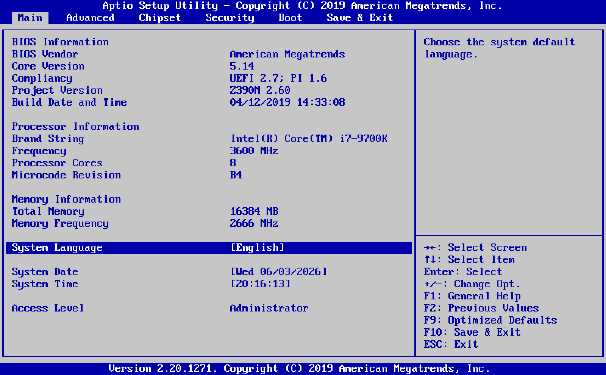

# BIOS Repair Service

A graphically accurate simulator of classic UEFI / legacy BIOS setup
utilities, wrapped in a fictional IT help-desk game: read a support
ticket, boot the customer's machine, dig through the firmware menus,
fix the misconfiguration, save and reboot, see if the ticket is
resolved. Written in Python + Pygame. No real firmware is touched.



## Download

Pre-built single-file executables for Windows, Linux and macOS are on
the [Releases page](https://github.com/Alvaro3234/bios-game/releases/latest):

- `bios-windows-x64.exe` — double-click to run
- `bios-linux-x64`       — `chmod +x bios-linux-x64 && ./bios-linux-x64`
- `bios-macos`           — `chmod +x bios-macos && ./bios-macos`

Or from source:

```
pip install pygame numpy
python main.py
```

Requires Python 3.10+.

## Modes

The main menu (shown at launch) lets you pick:

- **Challenge Mode** — a curated campaign of 34 repair tickets that
  resumes at the last unsolved level. Each level shows a briefing,
  drops you into Setup with a pre-applied "sabotage", and judges your
  fix on the reboot. Failed attempts reveal one more hint each;
  senior-tier levels (11+) mostly have none. Some machines need more
  than menu work: a dead CMOS battery loses your fixes on every power
  cycle, and a board with no video can only be revived from the bench
  (see the TOOLBOX on the briefing screen).
- **Endless Shift** — a procedurally generated queue of tickets. Pick
  a random seed or the *daily challenge* (everyone gets the same
  tickets on the same day), choose 3 / 5 / 7 / 10 tickets per shift.
  Score is based on completion time and first-try bonuses.
- **Options** — toggle audio, toggle CRT scanlines, reset campaign
  progress.

Flags to bypass the menu: `--no-menu` resumes the campaign directly,
`--freeplay` opens the BIOS without a game, `--shift SEED` jumps
straight into an endless run.

## Four BIOS skins

Challenges declare which firmware UI the customer's machine runs.
Same underlying menu model, four very different presentations — each
with its own POST sequence, boot logo, boot prompt and beep codes
(the AMI badge, the Award-era Energy-Star-style emblem and the Phoenix
bird are pixel art drawn at runtime — no image files involved):

- **AMI Aptio** — the modern blue/grey UEFI Setup Utility (the
  default for most tickets). Memory count in MB, debug code in the
  corner, DEL/F2 to enter Setup.
- **Award** — the early-2000s blue/cyan CMOS Setup: an authentic
  two-column home menu of categories (STANDARD CMOS SETUP,
  INTEGRATED PERIPHERALS, PC HEALTH STATUS, ...) with the classic
  red selection bar. Kilobyte memory count, DEL-only Setup entry.
- **PhoenixBIOS** — the laptop-era grey Setup Utility with the boxed
  "Item Specific Help" panel and the famous two-row key legend.
  "640K System RAM Passed", F2 to enter Setup, grouped beep codes
  (memory failure = 1-3-3-1).
- **EFI Shell** — a black terminal: type `setvar vmx Enabled`,
  `bcfg boot dump`, `date 06/11/2026`, `reset cold`, etc. Tickets
  routed to this skin are CLI-only; ESC enters the shell from POST.

Customer CPUs are either **Intel** (VT-x, VT-d) or **AMD** (AMD-V /
SVM, IOMMU); the same item changes label depending on the brand.

## The simulated board

The machine itself has limits you can learn across tickets: XMP
Profile 2 (3600 MT/s) only trains with 1.45V DRAM voltage and a 2T
command rate, CPU ratios of 47x+ need a positive Vcore offset (and
53x+ never boots), disabling the CPU fan trips thermal protection,
and the M.2_2 socket steals SATA port 1's bandwidth. The **Ai
Tweaker** and **Monitor** pages expose memory/CPU overclocking and
live hardware readouts (temperatures, fan RPM, voltages — including
the CMOS battery's VBAT) that double as diagnostic clues.

## Keys

### Main menu / options
| Key | Action |
|---|---|
| `↑` `↓` | Select |
| `Enter` | Confirm |
| `ESC`   | Back / quit |

### Briefing screen
| Key | Action |
|---|---|
| any key | Power the machine on |
| `B` / `J` | Bench actions, when the TOOLBOX offers them (replace CMOS battery / clear CMOS jumper) |

Tickets that involve physical work show a TOOLBOX side toolbar on the
right of the briefing: each bench tool with its hotkey, an icon, and
whether it is available, already used, or not needed for this ticket.

### POST screen
| Key | Action |
|---|---|
| `DEL` / `F2` | Enter Setup (AMI; Award is DEL-only, Phoenix F2-only, EFI uses ESC) |

### Inside Setup (AMI / Award / Phoenix)
| Key | Action |
|---|---|
| `↑` `↓` | Select item |
| `←` `→` | Select screen / page (Award home: jump column) |
| `Enter` | Open submenu / option popup / edit field |
| `+` / `-` | Change option value in place |
| `F5` / `F6` | Change value (Phoenix/Award style) |
| `Tab` | Switch date/time element |
| `ESC` | Back out of submenu / exit dialog |
| `F1` | General help |
| `F2` | Load previous values |
| `F9` | Load optimized defaults |
| `F10` | Save & exit (reboots) |

### Inside the EFI Shell
| Command | Effect |
|---|---|
| `help`                       | List supported commands |
| `ls [page]`                  | List pages or items on a page |
| `getvar <id>`                | Read a variable |
| `setvar <id> <value>`        | Write a variable |
| `dmpstore`                   | Dump every NVRAM variable |
| `bcfg boot dump`             | Show boot priorities |
| `bcfg boot mv <a> <b>`       | Swap two boot slots |
| `time [hh:mm:ss]`            | Show or set the RTC time |
| `date [mm/dd/yyyy]`          | Show or set the RTC date |
| `map` / `memmap` / `dh` / `ver` | Environment information |
| `echo <text>`                | Print text |
| `reset cold`                 | Save and reboot |
| `exit`                       | Discard pending changes and quit |
| `↑` / `↓`                    | Recall previous commands |

### Global
| Key | Action |
|---|---|
| `F8`  | Toggle CRT scanlines overlay |
| `F11` | Toggle fullscreen |
| `F12` | Save a screenshot (`screenshot.png`) |

## Where state lives

All state is JSON, kept next to the executable (or alongside `main.py`
when running from source):

- `settings.json`      — current BIOS values and UI prefs (`_audio`, `_scanlines`)
- `progress.json`      — campaign level + failed-attempt count + active phase
- `shifts.json`        — Endless Shift high scores
- `user_defaults.json` — written by *Save as User Defaults*

`screenshot.png` is dropped next to the executable when you press F12.

## Building your own binary

PyInstaller bundles everything (Python, Pygame, NumPy, fonts) into one
file that runs without a Python install on the target machine.

```
# Linux / macOS
./build.sh

# Windows
build.bat
```

Output lands in `dist/`. A spec file (`bios.spec`) controls the bundle
and excludes optional Python stdlib (`tkinter`, `test`, …) to keep the
binary small. Cross-compilation is not supported — to get a Windows
`.exe` from Linux, push to GitHub and let the
[CI workflow](.github/workflows/build.yml) build it for you on a
Windows runner. Tagging a commit `vX.Y.Z` triggers the workflow and
attaches the three OS binaries to a GitHub Release automatically.

## Layout

- `main.py`        — window, scaling, event loop, screenshot mode
- `app.py`         — top-level state machine (menu → POST → Setup → Reboot → Outcome)
- `menu_screen.py` — main menu, endless prompt, options, confirm dialog
- `post_screen.py` — POST timeline (memory count, device detection, blinking prompt)
- `game.py`        — campaign progression, sabotage arming, goal evaluation
- `hardware_rules.py` — declarative boot constraints (the board's "silicon limits")
- `challenges.py`  — 34 hand-written tickets (data only)
- `procedural.py`  — 25 sabotage templates, red-herring injection, shift generator
- `shifts.py`      — shift scoring + high-score persistence
- `shell.py`       — EFI Shell command parser
- `vendors/`       — `ami.py`, `award.py`, `phoenix.py`, `efi.py` — one render module per skin
- `menu_data.py`   — data-driven definitions of all eight BIOS pages
- `menu_model.py`  — navigation, values, dependencies (`depends_on` graying), CPU-brand label resolution
- `theme.py`       — palette, grid dimensions, layout metrics (single AMI tuning point)
- `screen.py` / `renderer.py` / `font.py` — 100×31 cell buffer, glyph cache, pixel-art overlays
- `images.py`      — runtime-drawn pixel art (POST vendor logos, toolbox icons)
- `audio.py`       — synthesized POST beeps, key clicks, outcome jingles
- `paths.py`       — resolves resource vs. writable directories under PyInstaller
- `settings.py`    — atomic JSON persistence
- `smoke_test.py`  — headless functional test:
  `SDL_VIDEODRIVER=dummy SDL_AUDIODRIVER=dummy python smoke_test.py`

## Font

Renders with **PxPlus IBM VGA 8x16** from the
[Ultimate Oldschool PC Font Pack](https://int10h.org/oldschool-pc-fonts/)
(CC BY-SA 4.0, see `assets/fonts/LICENSE.TXT`). Falls back to Lucida
Console / Consolas / Courier New if the bundled TTF is missing.

## License

MIT — see [LICENSE](LICENSE) if present, otherwise treat the source as
MIT-licensed and the bundled font as CC BY-SA 4.0.
